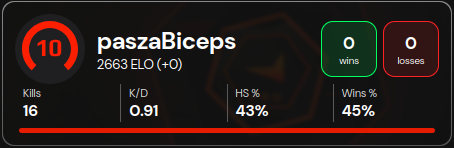

# FACEIT Stats Widget (Skull)

Pochodna rozszerzona wersja oryginału: [**mxgic1337/faceit-stats-widget**](https://github.com/mxgic1337/faceit-stats-widget) · [generator oryginału](https://widget.mxgic1337.xyz/)

**Live:** [faceitbanner.vxh.pl](https://faceitbanner.vxh.pl/)

Widget dla **[OBS Studio](https://obsproject.com/)** wyświetlający statystyki **[FACEIT](https://faceit.com)** (ELO, poziom, zmiana ELO, średnie statystyki).

Ten projekt **nie jest powiązany** z FACEIT.

## Pochodzenie i licencja

Ten repozytorium jest **pochodną** (fork z modyfikacjami) projektu [**mxgic1337/faceit-stats-widget**](https://github.com/mxgic1337/faceit-stats-widget), udostępnionego na licencji [**MIT**](https://github.com/mxgic1337/faceit-stats-widget/blob/main/LICENSE).

Zgodnie z MIT, w dystrybucji zachowujemy oryginalne informacje o prawach autorskich i licencji. Pełny tekst licencji (łącznie z atrybucją oryginału i modyfikacji) znajduje się w pliku [LICENSE](./LICENSE).

| | |
|---|---|
| Oryginał | [github.com/mxgic1337/faceit-stats-widget](https://github.com/mxgic1337/faceit-stats-widget) |
| Ta wersja | [github.com/skullboypl/faceit-banner-faceitbanner.vxh.pl](https://github.com/skullboypl/faceit-banner-faceitbanner.vxh.pl) |
| Autor modyfikacji | [Skull](https://github.com/skullboypl) |

## Stack technologiczny

| Warstwa | Technologia |
|--------|-------------|
| UI | **React 18** + **TypeScript** |
| Routing | **react-router-dom** |
| Bundler / dev server | **Vite 7** (`@vitejs/plugin-react-swc`) |
| Style | **Less** |
| Pakiety | **pnpm** |

## OBS

Wygeneruj link w generatorze na stronie, dodaj w OBS źródło **Browser** i wklej URL widgetu.
